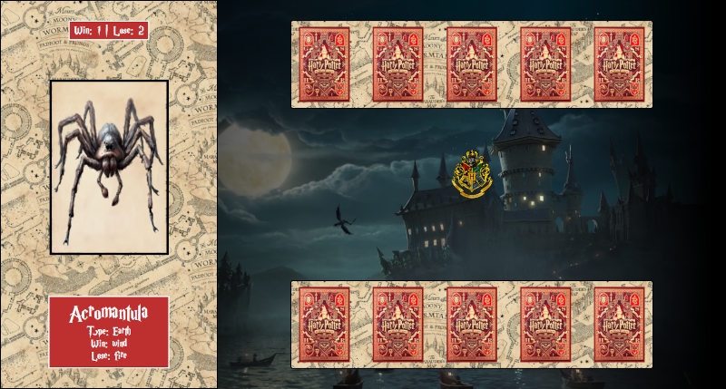

# Harry Potter Card Game

Este jogo de cartas foi inspirado em um projeto anterior de Jokenpo com tema de Yu-Gi-Oh! desenvolvido por [Felipe](https://www.linkedin.com/in/felipe-exe/) da DIO. Agradecemos a ele pela inspiração inicial.

## Sobre o Jogo

Neste jogo, os jogadores se envolvem em emocionantes duelos de cartas no mundo mágico de Harry Potter. Existem nove cartas no total, divididas em três tipos: Fogo, Terra e Vento. Cada tipo tem três cartas associadas a ele. O jogo segue a dinâmica de vantagem entre os elementos, onde Fogo tem vantagem sobre Terra, Terra sobre Vento e Vento sobre Fogo.

Cada jogador recebe aleatoriamente cinco cartas no início da partida. Em cada rodada, os jogadores escolhem uma carta para jogar, e o computador seleciona uma carta aleatória. Com base nos tipos de carta escolhidos, é determinado quem vence a rodada.

O jogo apresenta um vídeo de fundo relacionado ao universo de Harry Potter, acompanhado por trilha sonora temática. Além disso, há efeitos sonoros para indicar vitória ou derrota em cada rodada.

## Como Jogar

1. Escolha uma carta para jogar da sua mão.
2. O computador selecionará aleatoriamente uma carta para jogar.
3. Com base nos tipos de cartas escolhidas, determine quem vence a rodada.
4. Repita o processo até o final da partida.

## Acesso ao Jogo

Clique [aqui](https://mattheus910.github.io/harry-potter-game) para acessar o jogo.

## Screenshot

---

Divirta-se explorando o mundo mágico de Harry Potter enquanto enfrenta desafios estratégicos neste emocionante jogo de cartas!

## Contato

Fique à vontade para entrar em contato com o desenvolvedor caso tenha alguma sugestão ou comentário sobre o jogo:

- Desenvolvedor: [Matheus Martins]
- [E-mail](matheusmartins910@gmail.com)
- [Linkedin](www.linkedin.com/in/mattheus910/)

